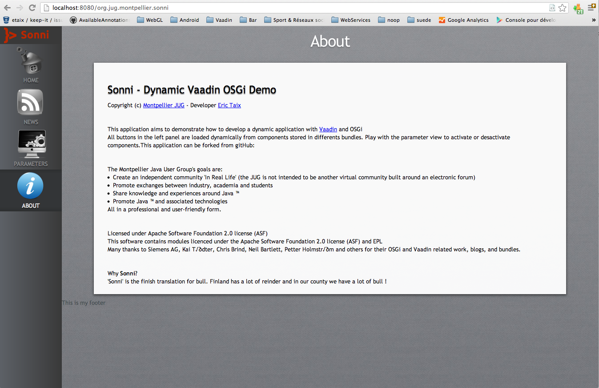

Sonni
=====
Author : Eric Taix - Montpellier JUG

What is it?
===========
Sonni is a proof of concept for dynamic Vaadin OSGi development. It aims to demonstrate how to use Vaadin (6.7) and OSGi to build a fantastic dynamic application.  
This application will be used during a live coding session organized by the Montpellier Java User Group.  

What means 'Sonni'?
===================
'Sonni' is the finish translation for 'bull'. Finland has a lot of reinders and we have (in the south of France) a lot of bulls.  

How to install
==============

- Create a new Eclipse Juno workspace  
- Download the zip file and extract it in your workspace  
- Import projects using 'File - Import - Existing projects from workspace'  
- Open the file 'org.jug.montpellier.sonni.target/vaadin.target'  
- Click on the right upper link 'Set as Target Plateform'  
- Now your projects should compile  
- Right click on file 'org.jug.montpellier.sonni.main/Sonni OSGi' and 'Run as / Sonni OSGi' 
- In your favorite browser open the URL http://localhost:8080/org.jug.montpellier.sonni  
- To manage bundles and components, connect you to the Equinox console : telnet localhost 5555  

Screenshots
===========
In this screenshot all the left buttons are dynamic components loaded from different bundles.  

Many thanks to
==============
Siemens AG, Kai Tšdter, Chris Brind, Neil Bartlett, Petter Holmstršm and others for their OSGi and Vaadin related work, blogs, and bundles which helped me a lot.  
And of course many thanks to Vaadin team.